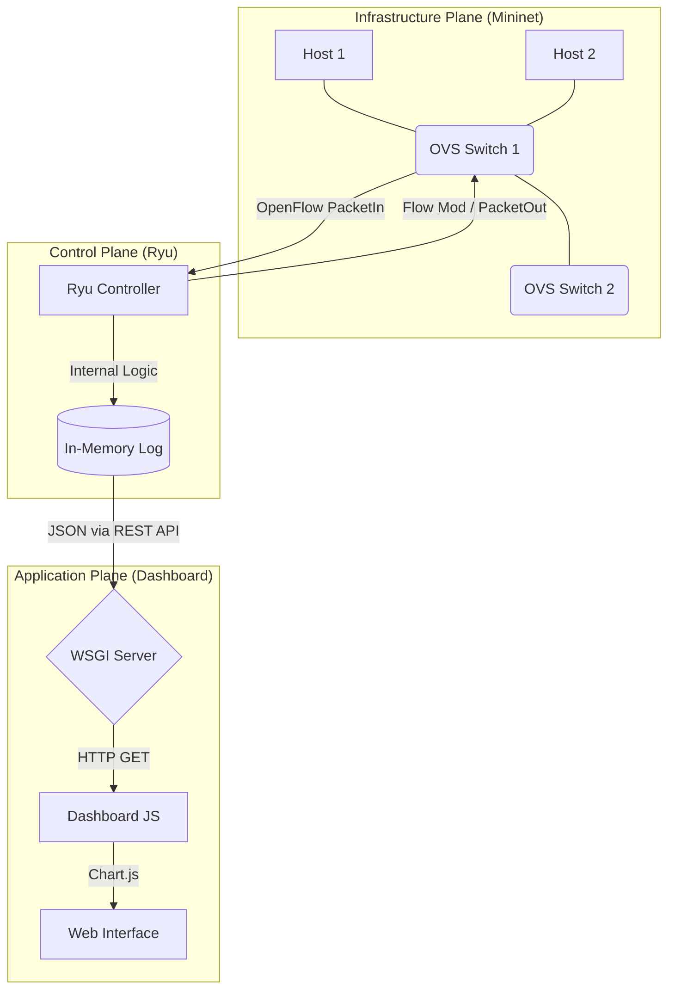

# 🏛️ Project Architecture

This document outlines the technical design of the SDN Packet Logger, detailing how data flows from a physical (virtual) packet to a visual representation on the web dashboard.

## 1. High-Level System Design
The project follows the standard SDN controller pattern, separating the network into three distinct planes.

### Flow Diagram (Mermaid)
On GitHub, the code block below will render as a visual flowchart:

### 2. Layer Breakdown

#### A. Infrastructure Plane (Mininet + OVS)

- **Hosts**: Simulated end-devices (`h1`, `h2`, `h3`) generating traffic.
- **Open vSwitch (OVS)**: Acts as the **"Data Plane."** It does not know how to handle new packets by default.
- **Protocol**: Communication between the switches and the controller is handled via **OpenFlow 1.3**.

#### B. Control Plane (Ryu Controller)

This is the **"Brain"** of the network. The script `p_log.py` performs three main tasks:

- **Event Handling**: Listens for `EventOFPPacketIn` (when a switch sees a packet it doesn't recognize).
- **Packet Parsing**: Uses `ryu.lib.packet` to dissect the Ethernet frame and identify the protocol (ARP, ICMP, TCP, UDP).
- **Instruction**: Tells the switch to **FLOOD** the packet so connectivity is maintained while logging the metadata.

#### C. Application Plane (REST API & Dashboard)

Ryu runs a built-in WSGI web server on **port 8080**.

- **The API**: A `ControllerBase` class listens on the `/stats` route. When called, it thread-locks the log buffer and returns a JSON snapshot.
- **The Dashboard**: A client-side application that uses the **Fetch API** to pull data every **2000ms** and updates the DOM and Chart.js objects.

---

### 3. Data Flow Example: A Single Ping

1. `h1` sends an **ICMP Echo Request** to `h2`.
2. Switch 1 has no **Flow Entry** for this packet, so it encapsulates the header and sends a **PacketIn** message to the Controller.
3. Ryu receives the message, increments the ICMP counter, and adds a timestamped entry to the deque.
4. Ryu sends a **PacketOut** command telling the switch to broadcast the packet.
5. The Dashboard (polling every 2s) hits the `/stats` endpoint, receives the updated JSON, and the **ICMP bar** on the chart grows.

---

This version is clean, well-structured, and ready to use in documentation or a README file. Let me know if you want any adjustments (e.g., adding code blocks, emojis, or different heading levels)!
